# SSMIF Factor Model

## Introduction

The ultimate goal of the SSMIF's factor model is to inform Senior Management on investment decisions by providing optimal allocations across the sectors of the S&P 500 (excluding real estate). In order to do so, the model uses as much valuation and sentiment data as is available since 1990 in addition to macroeconomic data to model the movement and performance of each sector. Movemenent is predicted using three different models, all the models' predictions are blended together and used in a genetic optimization technique that scores different combinations of sector weights using an objective function that takes into account returns, volatility, VaR, and CVaR all relative to the fund's benchmark, the S&P 500. Once the optimization is completed, we have our optimal sector allocations and we can run them through a backtest which calculates various statistics and generates graphics that provide information about performance of the models as well as the constructed portfolio.

The code in this repository **should** be sufficiently commented so that future members of the QIS team, specifically those that will work on the factor model, can understand the code and what everything is meant to do. This document is meant to be supplemental in case comments aren't clear enough, or as a general guide for anyone within the fund that wants a more in-depth understanding of the factor model.

------

## Detailed Methodology

### Data Collection

**_Relevant files:_** `DataLoad.R`

#### Retrieving Data From Bloomberg

Ideally, the factor model should be run on a Bloomberg Terminal so that the most up-to-date data is being used, but in practice, once a week should be fine when experimenting with the model just to make sure it can still handle new data as expected (Note: make sure you're logged into the Bloomberg software, and that the BBComm service is running so that it can communicate with the API we are using). If on a Terminal, all the data is retrieved by factor category (valuation, sentiment, macroeconomic) on a per-sector level and cleaned based on what type of factor it is:

* **Valuation Data:** For valuation data, just the weekends and market holidays/closures are removed so it doesn't have to be done every time the file is loaded again.

* **Sentiment Data:** This data is retrieved using the S&P 500 sector ETFs (eg. "XLK US Equity") as proxies since the indices we use for the valuation data aren't exchange-traded. With the ETFs, we can access the sentiment-related data we're looking for, including the percentage of shares which are owned by institutions, the total volume traded and the put-call open interest ratio of the options on those ETFs. For insititutional ownership, the data is only reported on Sundays beginning in March 2010 (except Communication Services, since its constituents were changed around in the summer of 2018 according to changes in the GICS), so we copy each Sunday's level and extend it to the rest of that week.

* **Macroeconomic Data:** Similar to the sentiment data, a lot of the macro data we collect is measured and reported at a lower frequency than the rest of the data, so for each of those fields, the value is extended for the entire month/quarter.

Once the data for each factor category is cleaned and processed, it is all written to CSV files in corresponding folders under the `data/` directory. Also collected is the most recent daily data for the SPX Index and each sector's index (eg. "S5INFT Index" for the IT sector), which are saved in `data/SPX.csv` and `data/sectors.csv` respectively. The motive behind saving all the data to files (and not just use the data directly) is that it allows you to work with the model on your own computer and not just when you're in the Hanlon labs.

#### Loading Locally-Saved Data

Regardless of whether or not you're on a Bloomberg Terminal, the data is loaded from the saved files for preparation to use in the models. Most of the heavy lifting here has to do with making sure the data is formatted so it can be merged properly, as well as calculating some of the derived factors, such as PEG (or what is supposed to be PEG, the factor model when I first started working on it actually calculates this as 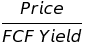. We tried fixing this so it finds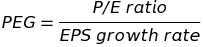, but the model results became far less accurate, so it was kept as . Finally, once the valuation, sentiment, and macroeconomic data are all merged for each sector, it is split up in a roughly 70/30 split into training and testing data, and then we are ready to move onto modelling.

### Modelling

**_Relevant files:_** `linearAnalysis.R`, `arimaAnalysis.R`, `randomForestAnalysis.R`

The actual modelling that we do is split across three different methods: a linear regression, an ARIMA time series model, as well as a random forest regression. The methodology for each of these is pretty standard: each model is fitted using the training data, predictions are generated across the domain of the testing period, then we measure error between the model predictions and actual values of each sector index. The error measure was recently changed to the log of the accuracy ratio 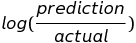. Previously, we had used mean absolute percentage error, but after some research, we found MAPE was a biased metric in that [it would favor models with predictions that are systematically too low](https://papers.ssrn.com/sol3/papers.cfm?abstract_id=2635088), leading to using the symmetric log-based measure.

#### Linear Regression

The model we construct and regressors used are consistent across every sector, and used in both the linear regression and later on for the random forest regression. Currently, the linear and random forest models are constructed as follows:

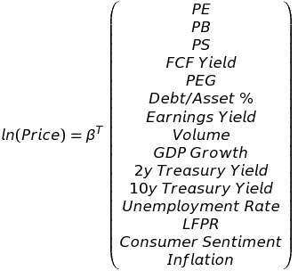

where  is the vector of coefficients that are generated when the model is fitted for each sector. The ARIMA models are similar, with additional terms 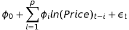 and 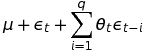 to capture the AR and MA movement, respectively.

Once the models are all fitted using the training data, we generate the predictions for each model so that we can measure the error of each, and ultimately optimize how those predictions are blended together. The loss function that we use as a measure of error is as follows:

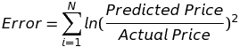

For reference, the calculated errors per sector per model (as of February 28, 2020) is as follows:

|          |   LIN  |  ARIMA |    RF   |
|:--------:|:------:|:------:|:-------:|
|   **IT** |14.5854 | 0.2284 | 35.2586 |
|  **FIN** |16.1205 | 2.8901 | 14.0032 |
|  **ENG** | 2.1826 | 5.3581 | 17.1124 |
| **HLTH** | 0.4087 | 0.0531 | 37.2373 |
| **CONS** | 0.0821 | 3.0412 | 35.6733 |
| **COND** | 0.3226 | 0.5113 | 42.3518 |
| **INDU** | 4.0867 | 0.0946 | 30.8783 |
| **UTIL** | 8.9123 | 0.2795 | 9.349   |
| **TELS** | 8.5881 | 3.6411 | 4.0634  |
| **MATR** | 1.2418 | 1.8983 | 12.8529 |

#### Blending Model Predictions

Since we use three modelling methods, we have to combine the predictions made by each into a master set of predictions over the testing period, which will ultimately be used in the optimization method. Since we measure error for each model, we want to give more weight to the model whose predictions have lower errors than those with higher errors.

To do so, we implement an inverse weighted average method that does exactly this by calculating the inverse percentage of each model's error across all the models for that sector, then dividing each of those "factors" by the sum of all factors for that sector. Using an example (COND) makes this concept easier to understand:

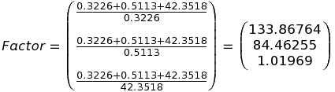

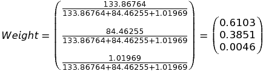

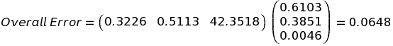

As expected, the random forest model, which has an astronomically high error compared to the linear regression and ARIMA analysis, gets almost zero weight while the lowest error from the linear regression gets over 60% weight towards the overall error and the predictions.

Using the February 28th data again, these are the factors, model weights, and overall errors for each sector:

|      | LIN Factor | ARIMA Factor | RF Factor | LIN Weight | ARIMA Weight | RF Weight | Overall Error |
|:----:|:----------:|:------------:|:---------:|------------|--------------|-----------|---------------|
|   **IT** |    3.517   |    224.579   |   1.406   |    1.53%   |    97.85%    |   0.61%   |     **0.1668**    |
|  **FIN** |    2.113   |    11.788    |   2.263   |   13.07%   |    72.93%    |   14.00%  |     **4.2259**    |
|  **ENG** |   10.692   |     4.355    |   1.477   |   64.70%   |    26.36%    |   8.94%   |     **1.2395**    |
| **HLTH** |   89.032   |    685.14    |   1.013   |   11.49%   |    88.38%    |   0.13%   |     **0.0487**    |
| **CONS** |   476.546  |    12.869    |   1.087   |   97.15%   |     2.62%    |   0.22%   |     **0.0762**    |
| **COND** |   137.563  |    88.789    |   1.019   |   61.04%   |    38.51%    |   0.45%   |     **0.0648**    |
| **INDU** |    9.031   |    390.024   |   1.128   |    2.26%   |    97.46%    |   0.28%   |     **0.0959**    |
| **UTIL** |    2.071   |    66.017    |   1.993   |    2.95%   |    94.20%    |   2.84%   |     **0.4230**    |
| **TELS** |    1.926   |     4.544    |   3.836   |   18.69%   |    44.08%    |   37.22%  |     **3.7891**    |
| **MATR** |   12.479   |     8.164    |   1.254   |   56.99%   |    37.28%    |   5.73%   |     **0.9558**    |

#### Model Accuracy

To help keep track of how these models are performing, and to make it easier to interpret model performance, we created a graphic that illustrates the cumulative return of each sector during the testing period as predicted by the models versus the actual return:

As we can see, the models do a good job of predicted the movement of each sector, with a few exceptions:
* **Financials**: the financial sector predictions begin to diverge in late 2016 - likely due to the presidential election, which caused the market to rally around bank stocks in anticipation of financial deregulation. Here, the ARIMA model's predictions were weighted the most, and gave all the sentiment factors either little to no contribution in the model because of so much missing data in the training period - meaning that the model couldn't capture what was a sentiment-driven rally in that sector.
* **Communication Services**: officially, this was the Telecommunications sector until late in the summer of 2018 when significant changes were made to the sector and it was renamed to its current title. Specifically, companies like Facebook, Netflix, Google, and Disney were added to this sector, and brought with them much higher valuation metrics than were in the sector previously dominated by AT&T and Verizon, which explains the very clear jump in predicted return around that time for the sector.
* **Materials**: the models predictions were more volatile than the actual returns over that time, which could mean that the optimization gives less weight to that sector because it still ends up around the 25% cumulative return the sector actually achieved, but with higher risk metrics, which the objective function will penalize it for.

### Optimization

**_Relevant Files_**: `geneticBreedv2.R`

To find the optimal weights, we employ a genetic breeding algorithm, which essentially starts out with a set of random weights and "breeds" children with them, and then kills off the lowest performing sets of weights according to our objective function that we are optimizing:

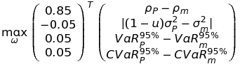

Ultimately, this is optimizing Sharpe ratio, as we are trying to maximize excess return, 95% VaR, and CVaR of the portfolio over the benchmark S&P 500 while trying to match the market's volatility with some undershoot percentage 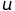 - this is so we can aim to achieve the investment goals outlined in the IPS of beating the market with less risk.

For reference, the previous optimization method used to find the best weights was through a Monte Carlo simulation that generated 10,000 weights and chose the portfolio with the highest return with less risk than the market. However, the results from the simulations were far too random after every run, even when testing on the same dataset. The genetic algorithm so far has seemed to solve this problem, and in `results/weightsHistory.csv`, we started tracking the weekly factor model outputs, and controlling for some methodology changes over time, the weights are much more consistent (Note: please don't open the weights history file using Excel and then save it - Excel automatically formats the dates, so if you tried to read the file back into R, you'd run into errors and would have to discard the changes using GitHub).

#### Genetic Optimization Algorithm

1. **Population Generation:** First, we generate and save 6,000 random weights that abide by our investment policy of no shorts and no more than 25% of the portfolio in a single sector. We generate that many as that is the total population size we'll aim to maintain in each of the 10 generations that we breed. 

2. **Scoring:** In each generation, the first thing we do is score each set of weights by plugging them into our objective function. This process alone takes more time than everything else in the factor model combined, as it involves taking a set of weights, building the portfolio and then calculating the return, risk, VaR and CVaR, the last two of which are the most intensive. Although each call to `score()` takes only 0.12-0.15 seconds, doing so 6,000 times in each generation adds up. 

3. **Killing:** The way these weights are optimized is by "killing" off the least performing ones, and thus breeding children from only the best weights in each generation. The current survival rate is 1/3, so we find the score in the 67th percentile of the entire population, and any set of weights with a score less than that threshold is set to null (i.e. killed off). We keep track of these "kill scores" and plot them at the end just to confirm that with each generation, the threshold rises, meaning we are getting better weights each iteration:

4. **Breeding:**  Since only one-third of the population survive, we have to regenerate the population until we get back to the target 6,000, and the following is done in repetition until we do:
	* Select two sets of weights at random from the surviving population
	* Breed 3 children from those parent nodes
		* Two children come in the following way: for each sector, a random number between 0 and 1 is generated, and if it is less than 0.5, child A will inherit that sector's weight from parent 1 and child B will inherit that sector's weight from parent 2. If the number is greater than 0.5, then child A inherits from parent 2 and child B inherits from parent 1.
		* The third child C's weights are a simple average of the weights from child A and B
	* The children are put through a mutation function, which, with 0.5% probability for each sector, will increase that sector's weight by 1% and decrease another random sector by 1%
	* The rules for the weights are then enforced, so if any of the children have negative weights or weights greater than 25%, the child's weights will all be set to zero, which will result in a score of 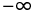 and definitely be killed off in the next generation. The weights of the children are normalized to make sure they sum up to 1, so that condition does not have to be checked specifically. 

	If we are at the tenth and final generation, then we stop the process once the bottom 2/3 of the population is killed off, and then choose the set of weights corresponding to the maximum score provided by the objective function, and then we have our optimal asset allocation across the S&P 500 sectors.

### Backtesting

**_Relevant Files_**: `fullTest.R`

Backtesting the optimal weights we found involves portfolio statistics throughout the entire period (1990-present), the testing period (last 9 years), and the current semester. We also generate graphics for most of the backtest results so we have them for reference as the factor model continues to evolve and to make it easier for any presentation/report material should we need to include information on the model.

All graphics below are from February 28, 2020.

#### Sector Weights

As previously mentioned, we also save these weights in `results/weightsHistory.csv` to monitor how the weights develop over time.

#### Cumulative Return Comparison

1. Overall

2. Testing Period

3. Current Semester

#### Portfolio Statistics vs S&P 500

Here we save a table of statistics of the portfolio vs the SPX including cumulative return, total volatility, Sharpe ratio, 95% VaR and CVaR, and return comparisons for the three recessions that occurred over the period we have data for:

## Future Plans

* Get data on mutual fund inflows and outflows for each sector (currently in progress)
* Consolidate some factors like Treasury Yields -- rather than use 2y and 10y yields separately, use the 2-10 spread
* Finalize recession probability model and use the output of that as a macroeconomic factor in the model

------

_All methodology described above as of Feb 22, 2020_
